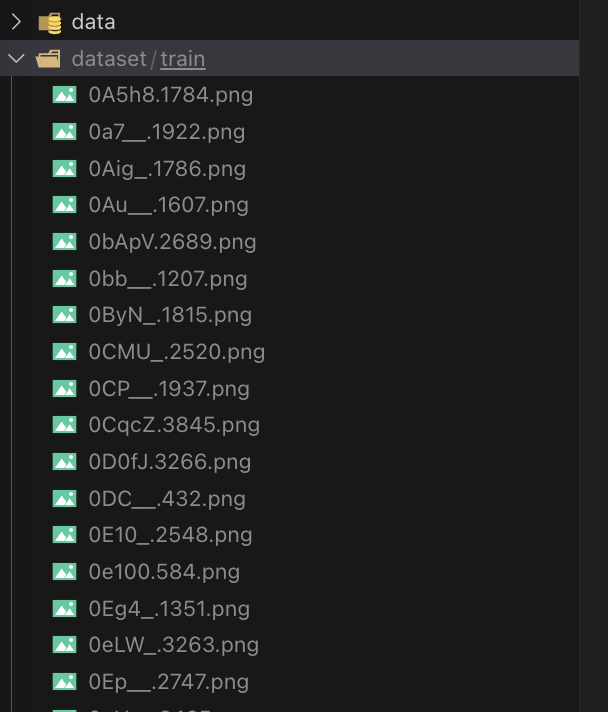

# PyCAPTCHA with Flexibility Captcha Length


---

**An End-to-end Pytorch-Lightning implemented CAPTCHA OCR model.**  
Training 2 epoch under 100k images to get over 96% acc on Val dataset 🤩  
> with 200k or even more training set you may get >98% acc




## INSTALL ⚙️
### Step0: Clone the Project
```shell
git clone https://github.com/anhnx000/solve_captcha_pycaptcha.git
cd solve_captcha_pycaptcha
```
## Usage 🚀

### Training
```shell
python launcher.py --model_name resnet
```

### Resuming Training from a Checkpoint
You can continue training from a previously saved checkpoint:
```shell
python launcher.py --model_name resnet --resume_from_checkpoint ./checkpoint/your_checkpoint_file.ckpt
```

## Reference
> Checkout the PyCAPTCHA Usage in WIKI Page
Check the [Doc](https://github.com/ZiYang-xie/PyCAPTCHA/wiki)
